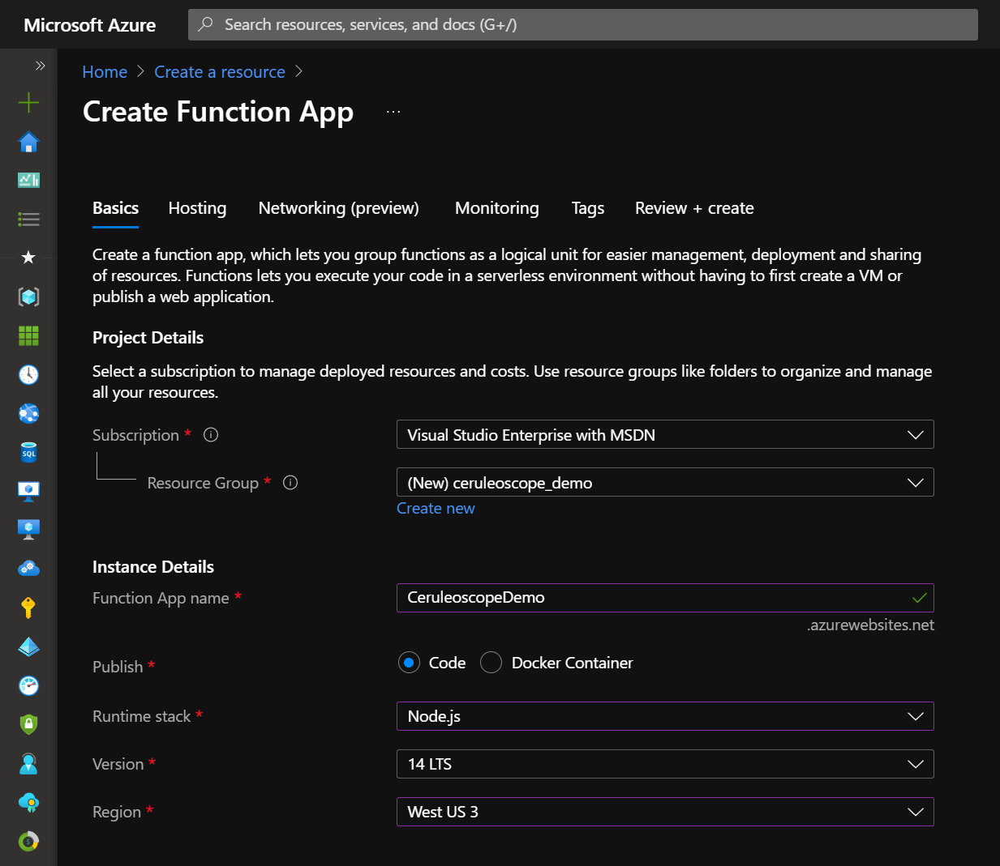
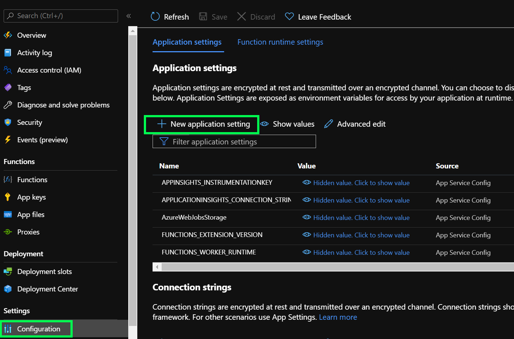
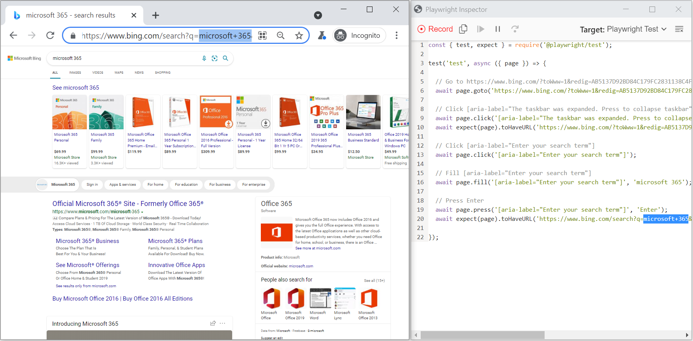
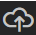
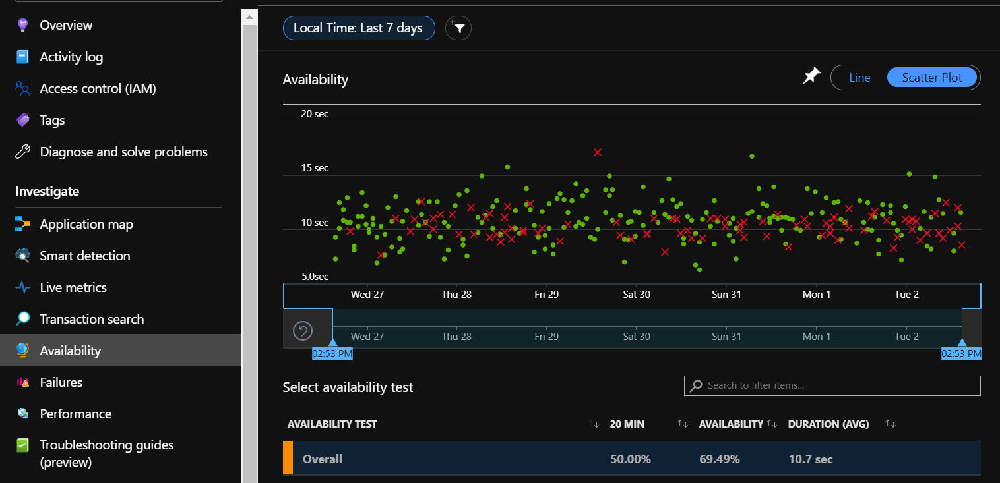

# Ceruleoscope: Playwright + Azure Functions + Application Insights Availability Testing

## Abstract

Ceruleoscope is an open source JavaScript library that facilitates custom web app availability testing by combining [Playwright](https://playwright.dev/) and [Application Insights](https://docs.microsoft.com/en-us/azure/azure-monitor/app/availability-overview), and allowing tests to run as a scheduled [Azure Function](https://azure.microsoft.com/en-us/services/functions/?&ef_id=Cj0KCQjw18WKBhCUARIsAFiW7JwOijIngF__o0X40S13lz_OXH5_TOWKfhbZDnquZ3gpAnx-i_iHZKUaAjHeEALw_wcB:G:s&OCID=AID2200277_SEM_Cj0KCQjw18WKBhCUARIsAFiW7JwOijIngF__o0X40S13lz_OXH5_TOWKfhbZDnquZ3gpAnx-i_iHZKUaAjHeEALw_wcB:G:s&gclid=Cj0KCQjw18WKBhCUARIsAFiW7JwOijIngF__o0X40S13lz_OXH5_TOWKfhbZDnquZ3gpAnx-i_iHZKUaAjHeEALw_wcB#features), with minimal effort.

This article will cover:
  - How to create an Azure Function with a Playwright test
  - How to deploy the function
  - How to observe the Availability telemetry
  - How to use secrets in tests
  - How to configure Storage
  
For feedback, feature requests and access to code please use **[Ceruleoscope github repository](https://github.com/microsoft/Ceruleoscope)**

### Short Version
The Short Version below is intended for a quick overview and requires some familiarity with Azure and VSCode. Below that is a Detailed Version of the same steps for those new to these environments.

- Create Azure Function App:

  - It must be **Serverless Linux/Node.js** app and Application Insights must be enabled.

  - Add this config setting to the function app:\
        **`PLAYWRIGHT_BROWSERS_PATH=/home/site/wwwroot/node_modules/playwright-chromium/.local-browsers/`**
  
  - Add Managed Identity and Key Vault, configure the function to access they Key Valut for storing test secrets
  
  - Add config settings to store variable data, access it via `process.env["config_name"]` in test

- Using **VSCode**, create a new Functions project with **javascript** and Timer trigger

  - Add this line in .vscode/settings.json:\
        **`scmDoBuildDuringDeployment=true`**

  - Remove "test" and add "node_modules" in .funcignore

  - Add these packages to the project (npm install):\
        `playwright`, `playwright-chromium`, `@playwright/test` and `ceruleoscope`

  - Generate a test script by running this command in VSCode's terminal:\
        `npx playwright codegen yourwebsite.com`

  - Save the test script in a new folder in the VSCode project with **\*.spec.js** filename

  - Replace the require statement in the test with\
        **`const { test, expect } = require("ceruleoscope");`**

  - If necessary, modify the test code to retrieve secrets and config values

  - Replace the function's **index.js** with this snippet:

``` javascript
        module.exports = async function (context, myTimer) {
          try{
            const { PlaywrightTestLauncher } = require("ceruleoscope");

            let responseMessage = await PlaywrightTestLauncher.Run();

            context.log("Playwright tests console output: " + responseMessage); // optional
          } catch(ex){
            context.log("Failed to run Playwright tests: " + ex);
          }
        }; 
```

  - Deploy the function app to Azure

- In Azure Portal (after the function has been deployed and triggered):

  - Navigate to the Function's Application Insights:
    - View Availability results and End-to-end transactions
    - Create alerts based on the test
    - Find links to Playwright's Trace files

  - Navigate to the Function's Storage account, `playwright-insights` container
    - Find Playwright Trace files
    - Configure container accessibility. For example set container accessibility to "Blob" so the Trace links can be downloaded in the browser
    - Configure blob lifespan to maintain a balance of cost and usability

### Detailed guide

#### Create Linux/Node.js Function App in Azure Portal

Open portal.azure.com in a browser, sign in.\
Your subscription must allow you to create and modify the resources mentioned in this guide.

Additional information about creating an Azure Function app can be found [here](https://docs.microsoft.com/en-us/azure/azure-functions/functions-create-scheduled-function#create-a-function-app).

- Click "Create a resource" in Azure Portal home page
- Select "Function App"
- Select/create the resource group and function app name suitable for you
- Select **Node.js** as the Runtime stack
- Version 14LTS+ or later\
    
- Select **Linux** as the operating system (the package doesn't work on Windows as it assumes some file structure)
- Plan type should remain "Consumption (**Serverless**)"
- **Enable Application Insights** must be "yes"

#### Customize the Function App in Azure Portal

Navigate to the Function App created above in Azure Portal

- Add a new application setting from the "Configuration" 
    
- Create a setting\
  **`PLAYWRIGHT_BROWSERS_PATH`**\
  with value\
  **`home/site/wwwroot/node_modules/playwright-chromium/.local-browsers/`**\
  Without this setting Playwright/Test will complain it can't find its browser engine
- `LOCATION` can be used to override the default location reported in the availability test (it region)
- `TESTNAME` can be used to override the default availability test name (the function app name)
- Click OK in the setting editing panel, it will close
- Click **"Save"** above the settings

#### Create Azure Functions Project in VSCode
[VSCode](https://code.visualstudio.com/download) offers the easiest to use environment, although it is possible to use other tools to create the function code.
Make sure [Azure Functions extension](https://docs.microsoft.com/en-us/azure/azure-functions/functions-develop-vs-code?tabs=csharp) is installed in VSCode as well (CTRL-Shift-X, search, install)    
- Open the Azure extension panel and expand the Functions to find the function app created in Portal
- You can extend the Application Settings node to confirm the `PLAYWRIGHT_BROWSERS_PATH` setting is there and correct
- Click the "Create New Project" icon It only shows up when the mouse pointer is inside the Azure/Functions panel
  - Select "**JavaScript**" for the language
  - Select "**Timer trigger**". (for development purposes HTTP trigger may be easier to use)
  - Enter a name for the function. Each Function App can host several functions
  - Configure a [cron expression](https://en.wikipedia.org/wiki/Cron#CRON_expression). The default one `(0 */5* \* \* \*)` is for every 5 minutes.

#### Customize the Functions Project in VSCode

- Replace the contents of `.vscode/settings.json` with

``` json
{
  "azureFunctions.deploySubpath": ".",
  "azureFunctions.projectLanguage": "JavaScript",
  "azureFunctions.projectRuntime": "~3",
  "azureFunctions.scmDoBuildDuringDeployment": true,
  "debug.internalConsoleOptions": "neverOpen"
}
```

- **`scmDoBuildDuringDeployment=true`** is important, as it instructs VSCode/Azure Functions extension to package the function app locally 
such that `npm install` will run remotely and Playwright install script will download its browser engine binaries.
Without this setting Playwright won't find its browser binaries.

- Edit `.funcignore` file in the project

  - Remove `test` - if it's present, tests may not be deployed and run
  - Add `node_modules` - it it's not present, the local copy of node_modules may get deployed and not have the correct browser binaries that Playwright otherwise downloads.

- Open a new Terminal in VSCode (CTRL-\`) and run these commands:\

``` powershell
npm install playwright
npm install playwright-chromium
npm install @playwright/test
npm install ceruleoscope
```

- Replace the contents of `index.js` for the function with:\

``` javascript
    module.exports = async function (context, myTimer) {
        try{
            const { PlaywrightTestLauncher } = require("ceruleoscope");
            let responseMessage = await PlaywrightTestLauncher.Run();
            context.log("Playwright tests console output: " + responseMessage);
        } catch(ex){
            context.log("Failed to run Playwright tests: " + ex);
        }
    };
```

#### Generate a Playwright Test in VSCode

- Create a new folder in the function's folder (not the project root folder) - GenTest

- Create a new file with ".spec.js" extension (ex: gentest.spec.js)\
 The ".spec.js" part of the file name is important as it is used by @playwright/test as a filename filter to find tests

- In the Terminal type this command:\
    `npx playwright codegen yourwebsite.com`

- A browser opens and shows a "Playwright Inspector" panel on the side\
    

- Exercise the feature that needs availability testing by navigating your web site\
    **AVOID USING REAL PASSWORDS, DO NOT LEAVE THEM IN THE TEST CODE**
  - Consider [using KeyVault and Managed Identities](https://daniel-krzyczkowski.github.io/Integrate-Key-Vault-Secrets-With-Azure-Functions/) to store your secrets.
  - Alternatively, use configuration settings in your Azure Functions app, if the secrets are not very sensitive.
  - Configure a dedicated identity/user in the app under test that is only used for this test and nothing else.
  - There is always a chance that secrets used to access the app under test are recorded in logs or trace files.

- Copy the generated test code from Playwright Inspector (must be JavaScript) into gentest.spec.js, as described above.
- The first line of gentest.spec.js will be\
    `const { test, expect } = require('@playwright/test');`\
  Replace the require statement with:\
    **`const { test, expect } = require("ceruleoscope");`**

- The test can be further customized as needed, for example to obtain secrets or add various assertions.
- Save the file 
- Run the test locally with this command in VSCode's Terminal:\
    `npx playwright test --headed`\
    where the `--headed` option instructs Playwright to show the browser.
- Test parameters that are provided in Azure Function's configuration can be emulated locally by adding them to [local.settings.json](https://docs.microsoft.com/en-us/azure/azure-functions/functions-run-local?tabs=v3%2Cwindows%2Ccsharp%2Cportal%2Cbash%2Ckeda#create-a-local-functions-project). 

#### Deploy the Function App from VSCode

- In VSCode open the Azure extension and click "Deploy to Function App..." icon 
- A drop-down appears to select a function app to deploy to, make sure to select the one created with node.js/Linux
- Click "Deploy" in the confirmation popup
- Monitor the deployment in the Output window (optional)
  - The output window will show if Playwright downloaded its browser binaries with a few lines *similar* to this:\
        `Playwright build of chromium v920619 downloaded to /home/site/wwwroot/node_modules/playwright-chromium/.local-browsers/chromium-920619`
  - The download location will be the same as the `PLAYWRIGHT_BROWSERS_PATH` config value
  - If there are no such lines in the output and the app doesn't appear to work,
check if `.vscode/settings.json` and `.funcignore` have been modified as described above, and all the npm packages are installed.

#### Verify the Function App in Azure Portal

- Navigate to the Function App in Azure Portal
- Click on the **Log stream** blade
  - It may take a few minutes for the next execution to start (depending on the timer trigger settings)
  - The logs should contain `Playwright tests console output: done`

- Click the **Application Insights** blade, navigate to the configured Application Insights resource
- The "Overview" blade of that Application Insights resource should show no Failed requests, and some Server requests (depending on the frequency configured for the time trigger)
- Check if there are failing or successful executions.\
    If there only failing executions, make sure all packages are included and the code runs locally in VSCode
- Click the **Availability** blade.\
    If the Availability telemetry is not found, but there are no failed executions, then make sure the `require` statement in the generated test is replaced.\
    

- Click the Availability blade to see the results of the availability test(s)
  - When the chart is in **Line** mode, the line represents the percentage of successful tests (higher is better)
  - When the chart is in **Scatter Plot** mode, the points represent individual test runs. Duration is the height of the dot, color indicates outcome (green is success) In Scatter Plot mode the points are clickable

- Click a point on the chart in Scatter Plot mode to see the test's [End-to-End transaction](https://docs.microsoft.com/en-us/azure/azure-monitor/app/transaction-diagnostics).

  - The top entry (globe icon) represents the availability test
  - Subsequent entries represent each page opened by the test and the connections that page made
  - Click the availability item (globe icon) to show properties associated with it.\
    In the **Custom Properties** section there is a property `traceFileLink`, which has a link to a Playwright trace file in Storage\
    Download the file and execute this command in VSCode's terminal:\
    `npx playwright show-trace traceFileName.zip`\
    Refer to [Playwright's documentation](https://playwright.dev/docs/trace-viewer) for Trace Viewer details.
- "View all telemetry" will show all logs associated with this availability test and can be useful for troubleshooting

- [Availability alerts](https://docs.microsoft.com/en-us/azure/azure-monitor/app/availability-alerts) can be configured in the Alerts blade

#### Browse Trace Files, Configure Access and Lifecycle

This step is optional and may depend on the security considerations of your organization.
Ceruleoscope uses a Storage account container `playwright-insights`. 
The container is private and only accessible via [Storage Explorer](https://azure.microsoft.com/en-us/features/storage-explorer), Azure Portal etc. 
The link in the availability test won't download via browser by default.

- Navigate to the storage account used by the Function App
- Click the **Containers** blade
- Double-click the "playwright-insights" container, select a trace file and download it

If the security constraints allow it, the [container access level](https://docs.microsoft.com/en-us/azure/storage/blobs/anonymous-read-access-configure?tabs=portal#set-the-public-access-level-for-a-container) can be set to "Blob" to allow downloading directly from a browser.
"Public" access if generally not a good practice.

It is recommended to create a [lifecycle policy](https://docs.microsoft.com/en-us/azure/storage/blobs/lifecycle-management-overview) for the Storage container, so that old Trace files are automatically deleted.
- Click the Storage account's **Lifecycle management** blade
- Add a rule "playwright-insights-expiration"
  - Select "Limit blobs with filters"
  - "Block blobs"
  - "Base blobs"
- In the workflow (Base blobs tab), set the condition to be `If Base blobs were last modified more than 90 days ago, then Delete the blob`
- In the Filter set, add a blob prefix `playwright-insights/` to manage all blobs in the container

This policy will ensure the Storage account doesn't continuously grow.


