# Ceruleoscope: Playwright + Azure Functions + Application Insights Availability Testing

## Abstract

Ceruleoscope is a JavaScript library that facilitates web apps availability testing by combining [Playwright](https://playwright.dev/) and [Application Insights](https://docs.microsoft.com/en-us/azure/azure-monitor/app/availability-overview), and allowing tests to run as a scheduled [Azure Function](https://azure.microsoft.com/en-us/services/functions/?&ef_id=Cj0KCQjw18WKBhCUARIsAFiW7JwOijIngF__o0X40S13lz_OXH5_TOWKfhbZDnquZ3gpAnx-i_iHZKUaAjHeEALw_wcB:G:s&OCID=AID2200277_SEM_Cj0KCQjw18WKBhCUARIsAFiW7JwOijIngF__o0X40S13lz_OXH5_TOWKfhbZDnquZ3gpAnx-i_iHZKUaAjHeEALw_wcB:G:s&gclid=Cj0KCQjw18WKBhCUARIsAFiW7JwOijIngF__o0X40S13lz_OXH5_TOWKfhbZDnquZ3gpAnx-i_iHZKUaAjHeEALw_wcB#features), with minimal effort.

## Overview

**Application Insights** offers several types of availability testing - URL ping test, multi-step web test, and the ability to create custom tests that use [TrackAvailability()](https://docs.microsoft.com/en-us/dotnet/api/microsoft.applicationinsights.telemetryclient.trackavailability?view=azure-dotnet) API. Availability data can also be used to create alerts.

**Playwright** is a platform that enables in-browser web testing through a set of APIs that interact with browsers and pages opened in the browser. It has rich set of test-oriented capabilities - use multiple browsers, manipulate web requests, inject javascript, record network activity, take screenshots, generate tests, record entire test sessions and more.

**Azure Functions** provides a great place to run web testing tasks and already has integration with Application Insights.

**Ceruleoscope** combines these three platforms for the purpose of web app testing. The user can write or generate Playwright tests, add them to a Function App, and see the availability results in Azure Portal.

## Using Ceruleoscope

The Short Version below is intended for a quick overview and requires some familiarity with Azure and VSCode. Below that is a Detailed Version of the same steps for those new to these environments.

### Short Version

- Create Azure Function App:

  - It must be Serverless Linux/Node.js app and Application Insights must be enabled.

  - Add this config setting:\
        `PLAYWRIGHT_BROWSERS_PATH=/home/site/wwwroot/node_modules/playwright-chromium/.local-browsers/`

- Using VSCode, create a new Functions project with **javascript** and Timer trigger

  - Add this line in .vscode/settings.json:\
        `scmDoBuildDuringDeployment=true`

  - Remove "test" and add "node_modules" in .funcignore

  - Add these packages to the project (npm install):\
        `playwright`, `playwright-chromium`, `@playwright/test` and `ceruleoscope`

  - Generate a test script by running this command in VSCode's terminal:\
        `npx playwright codegen yourwebsite.com`

  - Save the test script in a new folder in the VSCode project with **\*.spec.js** filename

  - Replace the require statement in the test with\
        `const { test, expect } = require("ceruleoscope");`

  - Replace the function's index.js with this snippet:

``` javascript
        module.exports = async function (context, myTimer) {
          try{
            const { PlaywrightTestLauncher } = require("ceruleoscope");

            let responseMessage = await PlaywrightTestLauncher.Run();

            context.log("Playwright tests console output: " + responseMessage);
          } catch(ex){
            context.log("Failed to run Playwright tests: " + ex);
          }
        }; 
```

  - Deploy the function app to Azure

- In Azure Portal (after the function has been deployed and triggered):

  - Navigate to the Function's Application Insights:
    - View Availability results and End-to-end transactions
    - Create alerts based on the test
    - Find links to Playwright's Trace files

  - Navigate to the Function's Storage account, `playwright-insights` container
    - Find Playwright Trace files
    - (optional) Set container accessibility to "Blob" so the Trace links can be downloaded in the browser

### Detailed guide

#### Azure Portal - Create Linux/Node.js Function App

Open portal.azure.com in a browser, sign in.\
Your subscription must allow you to create and modify the resources mentioned in this guide.

- Click "Create a resource" in Azure Portal\
    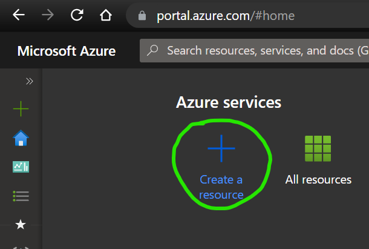
- Select "Function App"\
    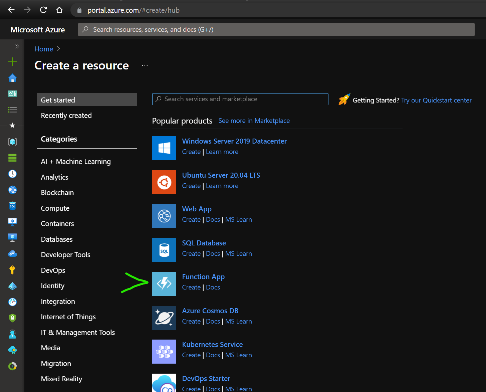
- Select/create the resource group and function app name suitable for you
- Select **Node.js** as the Runtime stack
- Version 14LTS+\
    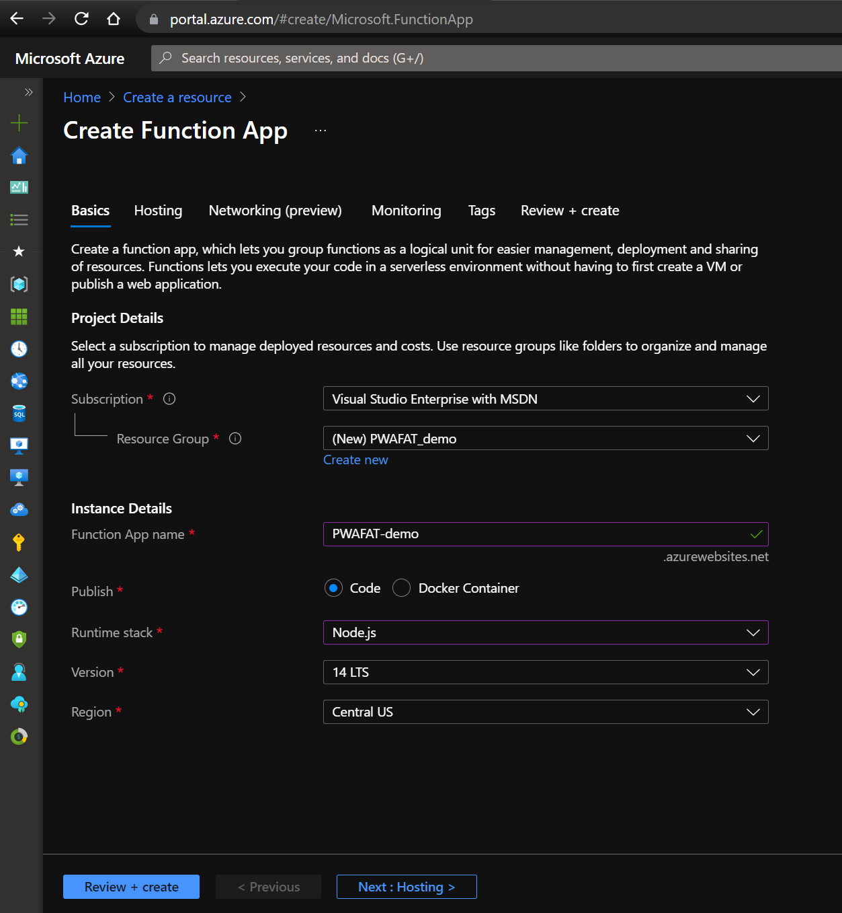
- Click Next: Hosting
- Storage account can be changed if needed. Trace and HAR files will be stored there (if enabled)
- Select **Linux** as the operating system (the package doesn't work on Windows as it assumes some file structure)
- Plan type should remain "Consumption (**Serverless**)"\
    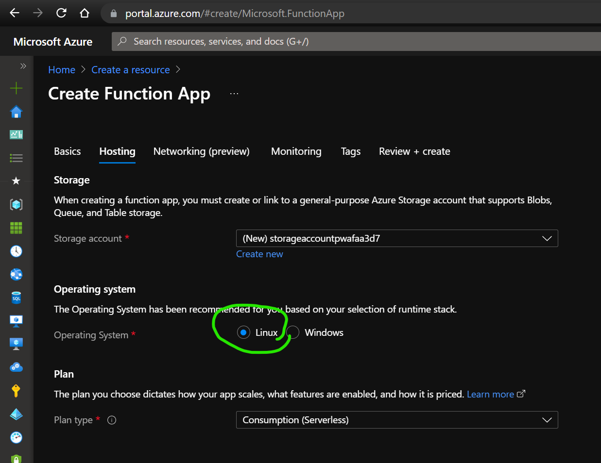
- Click "Next: Networking" and then "Next: Monitoring"
- Enable Application Insights must be "yes"\
    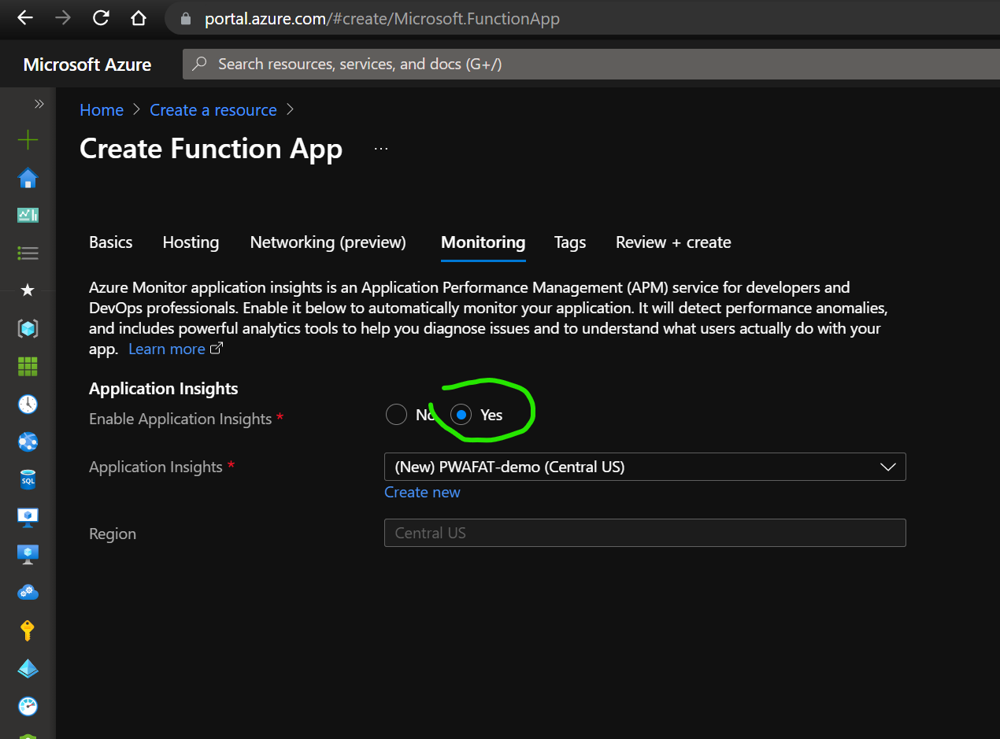
- Click "Review + create", check the properties and click "Create"

#### Azure Portal - Customize the Function App

Navigate to the Function App created above in Azure Portal

- Click on the "Configuration" blade
- Click on "+ New application setting"\
    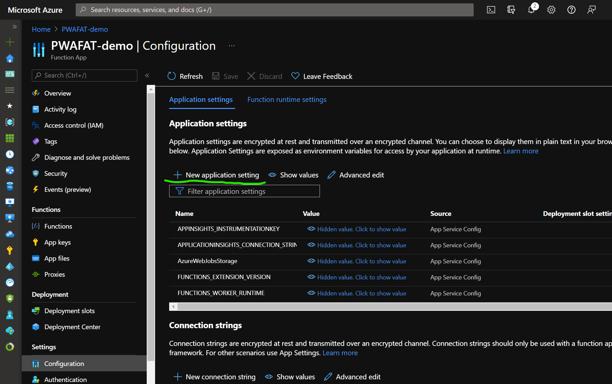
- Create `PLAYWRIGHT_BROWSERS_PATH` setting, with the value `home/site/wwwroot/node_modules/playwright-chromium/.local-browsers/`\
    without this setting Playwright/Test will complain it can't find its browser engine
- `LOCATION` can be used to override the default location reported in the availability test (it region)
- `TESTNAME` can be used to override the default availability test name (the function app name)
- Click OK in the setting editing panel, it will close
- Click "Save" above the settings, click "Continue" to confirm the Save\
    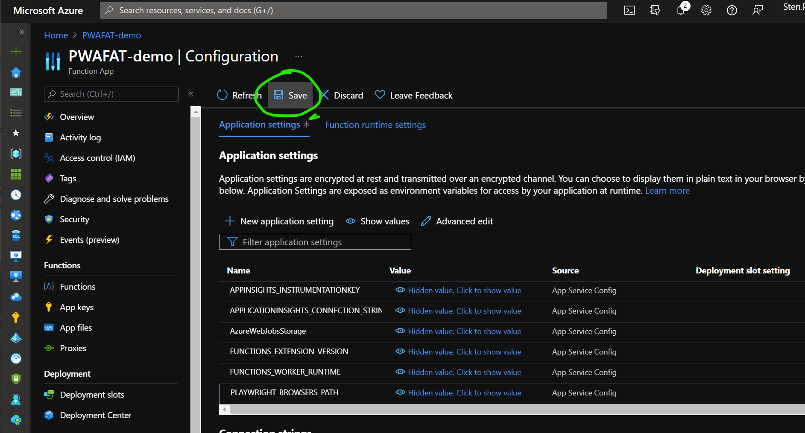

#### VSCode - Create Azure Functions Project

- Install and launch [VSCode](https://code.visualstudio.com/download). Install [Azure Functions extension](https://docs.microsoft.com/en-us/azure/azure-functions/functions-develop-vs-code?tabs=csharp) in VSCode (CTRL-Shift-X, search, install)\
    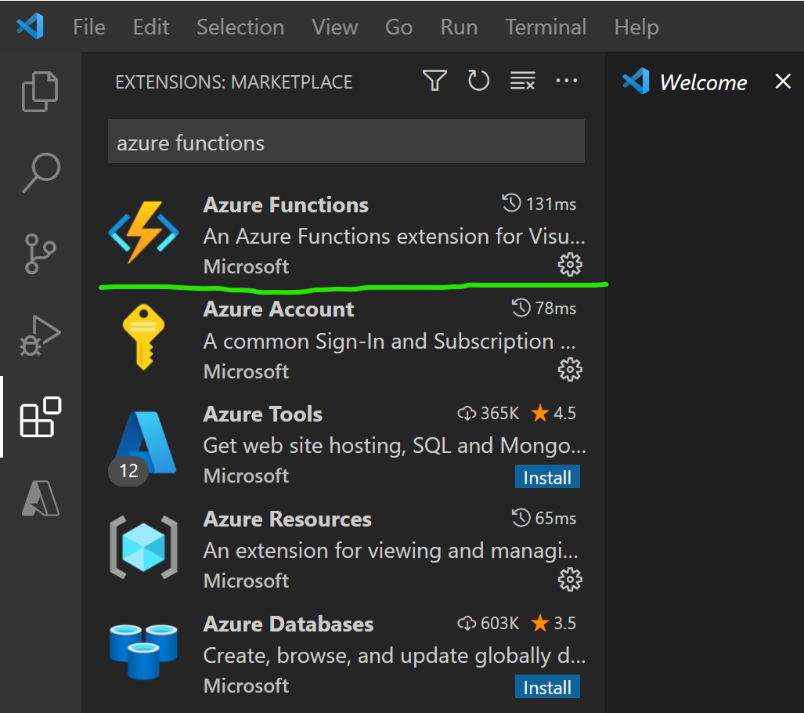
- Open the Azure extension panel and expand the Functions to find the function app created in Portal
- You can extend the Application Settings node to confirm the PLAYWRIGHT_BROWSERS_PATH setting is there and correct
- Click the "Create New Project" icon It only shows up when the mouse pointer is inside the Azure/Functions panel
- Create a new folder and select it\
    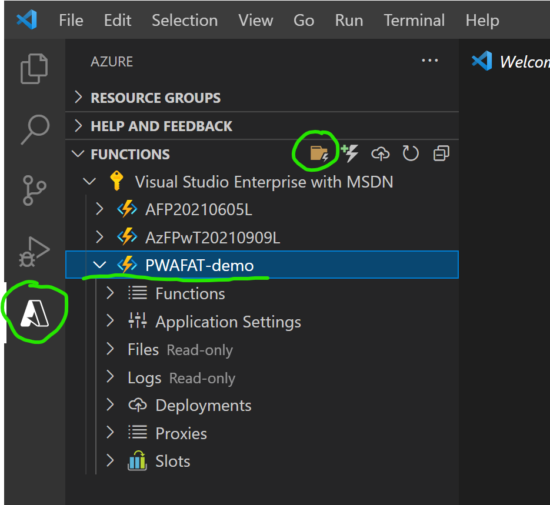
- A drop-down selection appears in VScode, select "**JavaScript**"\
    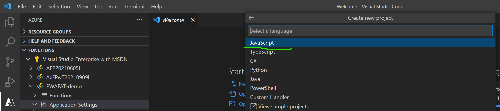
- Second drop-down appears, select "**Timer trigger**". (for development purposes HTTP trigger may be easier to use)\
    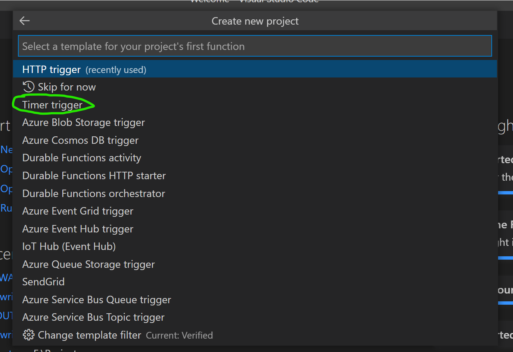
- Third drop-down appears, enter a name for the function. Each Function App can host several functions
- Fourth drop-down appears, enter a [cron expression](https://en.wikipedia.org/wiki/Cron#CRON_expression).\
    The default one (0 */5* \* \* \*) is for every 5 minutes; (0 15 \* \* \*) is for every hour at the 15 min [etc](https://www.freeformatter.com/cron-expression-generator-quartz.html)\
    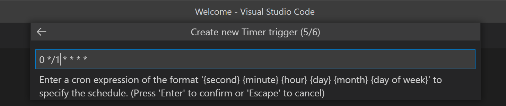

#### VSCode - Customize the Functions Project

- Replace the contents of `.vscode/settings.json` with

``` json
{
  "azureFunctions.deploySubpath": ".",
  "azureFunctions.projectLanguage": "JavaScript",
  "azureFunctions.projectRuntime": "~3",
  "azureFunctions.scmDoBuildDuringDeployment": true,
  "debug.internalConsoleOptions": "neverOpen"
}
```

- `scmDoBuildDuringDeployment=true` is important, as it instructs VSCode/Azure Functions extension to package the function app locally such that \`npm install\` will run remotely and Playwright install script will download its browser engine binaries. Without this setting Playwright won't find its browser binaries

- Edit `.funcignore` file in the project

  - Remove `test` - if it's present, tests may not be deployed and run

  - Add `node_modules` - it it's not present, the local copy of node_modules may get deployed and not have the correct browser binaries that Playwright downloads

- Open a new Terminal in VSCode (CTRL-\`) and run these commands:\

``` powershell
npm install playwright
npm install playwright-chromium
npm install @playwright/test
npm install ceruleoscope
```

- Replace the contents of `index.js` for the function with:\

``` javascript
    module.exports = async function (context, myTimer) {
        try{
            const { PlaywrightTestLauncher } = require("ceruleoscope");
            let responseMessage = await PlaywrightTestLauncher.Run();
            context.log("Playwright tests console output: " + responseMessage);
        } catch(ex){
            context.log("Failed to run Playwright tests: " + ex);
        }
    };
```

#### VSCode - Generate a Playwright Test

- Create a new folder in the project's root - GenTest

- Create a new file "gentest.spec.js" ??? the ".spec.js" part of the file name is important as it is used by @playwright/test as a filename filter to find tests

- In the Terminal type this command:\
    `npx playwright codegen yourwebsite.com`

- A browser opens and shows a "Playwright Inspector" panel on the side\
    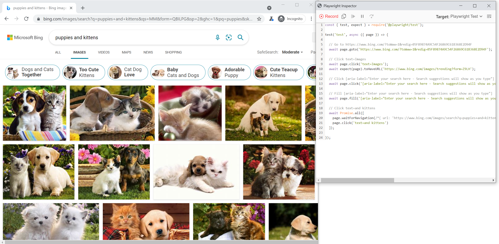

- Exercise the feature that needs availability testing by navigating your web site\
    **DO NOT ENTER PASSWORDS, OR LEAVE THEM IN THE TEST CODE**

  - Consider [using KeyVault and Managed Identities](https://daniel-krzyczkowski.github.io/Integrate-Key-Vault-Secrets-With-Azure-Functions/) to store your secrets
  - Alternatively, use configuration settings in your Azure Functions app, if the secrets are not very sensitive
  - Configure a dedicated identity/user in the app under test that is only used for this test and nothing else
  - There is always a chance that secrets used to access the app under test are recorded in logs or trace files

- When done, copy the generated test code from Playwright Inspector (must be JavaScript) into `./GenTest/gentest.spec.js`

- The first line of gentest.spec.js will be\
    `const { test, expect } = require('@playwright/test');`Replace the require statement with:\
    `const { test, expect } = require("ceruleoscope");`

- The test can be further customized as needed

- Save the file\
    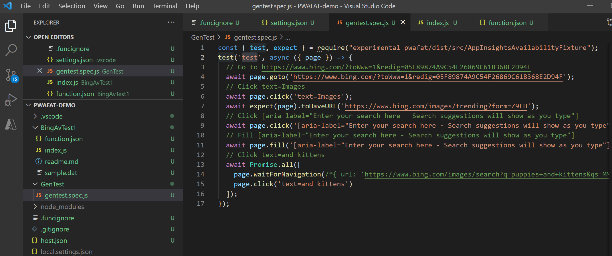

- Run the test locally with this command in VSCode's Terminal:\
    `npx playwright test --headed`\
    where the `--headed` option instructs Playwright to show the browser.

#### VSCode - Deploy the Function App

- In VSCode open the Azure extension and click "Deploy to Function App..." icon 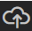

- A drop-down appears to select a function app, make sure to select the one created with node.js/Linux\
    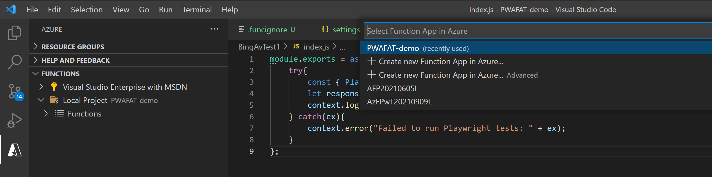

- Click "Deploy" in the confirmation popup\
    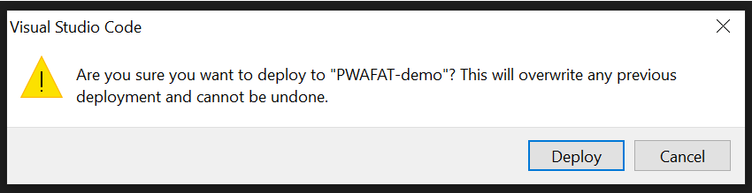

- Monitor the deployment in the Output window (optional)

  - The output window will show if Playwright downloaded its browser binaries with a few lines *similar* to this:\
        `Playwright build of chromium v920619 downloaded to /home/site/wwwroot/node_modules/playwright-chromium/.local-browsers/chromium-920619`
  - The download location will be the same as the PLAYWRIGHT_BROWSERS_PATH config value
  - If there are no such lines in the output and the app doesn't appear to work, check if `.vscode/settings.json` and `.funcignore` have been modified as described above, and all the npm packages are installed.

#### Azure Portal - Verify the Function App

- Navigate to the Function App in Azure Portal

- Click on the `Log stream` blade

- It may take a few minutes for the next execution to start (depending on the timer trigger settings)

- The logs should contain "Playwright tests console output: done"\
    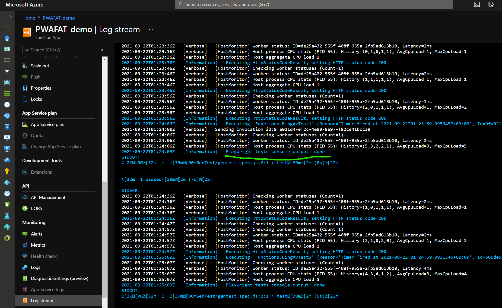

- Click the "Application Insights" blade, navigate to the configured Application Insights resource\
    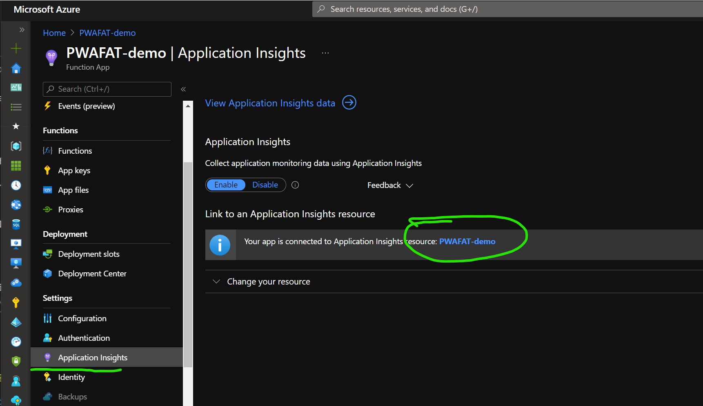

- The "Overview" blade of that Application Insights resource should show no Failed requests, and some Server requests (depending on the frequency configured for the time trigger)

- Check if there are failing or successful executions.\
    If there only failing executions, make sure all packages are included and the code runs locally in VSCode\
    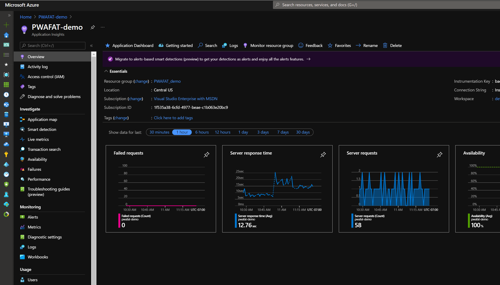
- Click the "Availability" blade.\
    If the Availability telemetry is not found, but there are no failed executions, then make sure the `require` statement in the generated test is replaced.\
    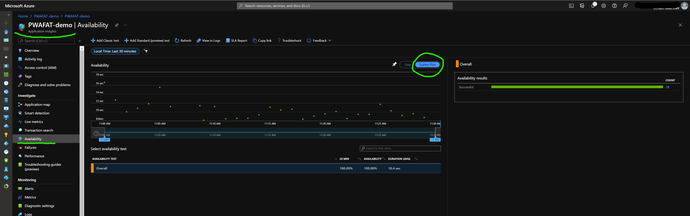

- Click the Availability blade to see the results of the availability test(s)

  - When the chart is in Line mode, the line represents the percentage of successful tests (higher is better)
  - When the chart is in Scatter Plot mode, the points represent individual test runs. Duration is the height of the dot, color indicates outcome (green is success) In Scatter Plot mode the points are clickable

- Click a point on the chart in Scatter Plot mode to see the test's End-to-end transaction details

  - The top entry (globe icon) represents the availability test

  - Subsequent entries represent each page opened by the test and the connections that page made

  - Click the availability item (globe icon) to show properties associated with it. In the Custom Properties section there are two properties

    - `traceFileLink` points to a Playwright trace file (if configured, on by default)\
            download the file and execute this command in VSCode's terminal:\
            `npx playwright show-trace traceFileName.zip`

    - harFileLink points to a HAR file (if configured, off)

- "View all telemetry" will show all logs associated with this availability test and can be useful for troubleshooting

- Alerts blade allows for rules to be configured to use the test results to send notifications as needed

#### Azure Portal - Trace Files Viewing and Access

This step is optional and may depend on the security considerations of your organization. By default, the storage account container Cerulean uses is private and only accessible via Storage Explorer, Azure Portal etc. The link in the availability test won't download via browser by default.

- Navigate to the storage account used by the Function App

- Click the Containers blade\
    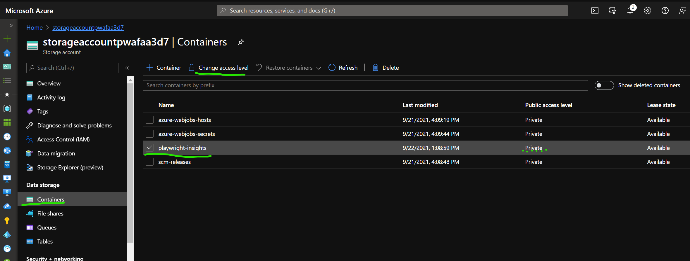

- Double-click the "playwright-insights" container, select a trace file and download it

    \- OR -

- Check the checkbox for "playwright-insights" container

  - Click "Change access level" button above the containers list\
        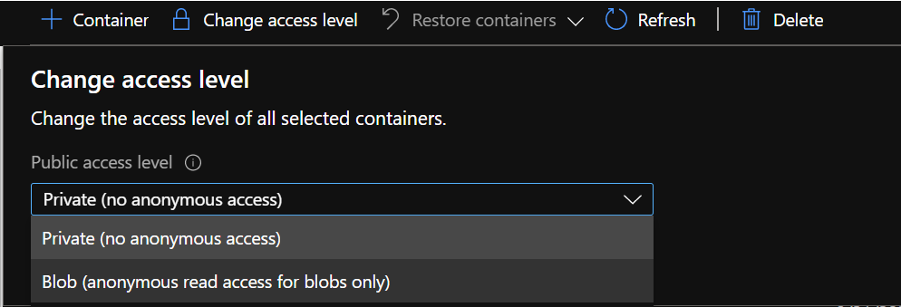

  - In the drop-down select "**Blob**" (it would be "Private" by default)

    - "Blob" access allows Trace file links to be downloaded in the browser without authentication, but doesn't allow listing other files in the container or the storage account
    - Trace files have a random part in their name, so having one link should not allow access to other trace files
    - "Public" access if generally not a good practice

- Downloaded trace files can be viewed by running this command in VSCode terminal:\
    `npx playwright show-trace  downloaded_trace_file.zip`

- Playwright Trace Viewer shows actions taken by the test and detailed view of the browser - screenshots, console, network activity etc.

  - On top is a timeline with screenshots of the page as the test progressed

  - On the left are the actions performed by the test

  - In the middle is the selected screenshot

  - On the right there are details about the page's activity: console, network etc

  - Refer to [Playwright's documentation](https://playwright.dev/docs/trace-viewer) for details

        
